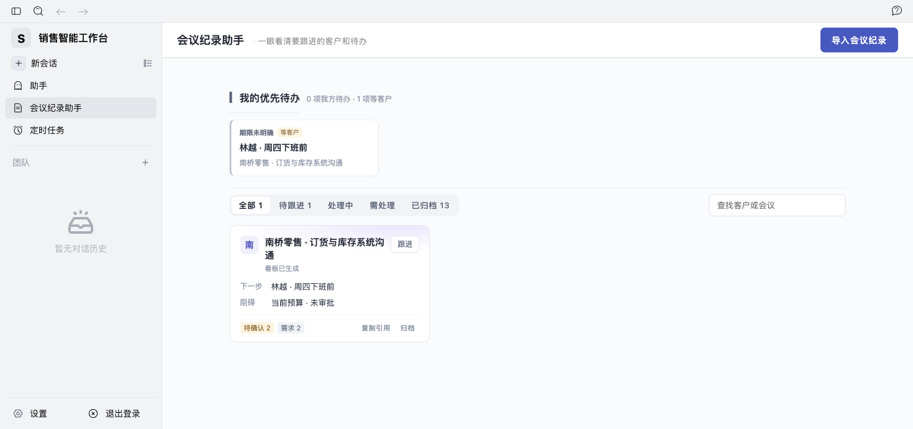
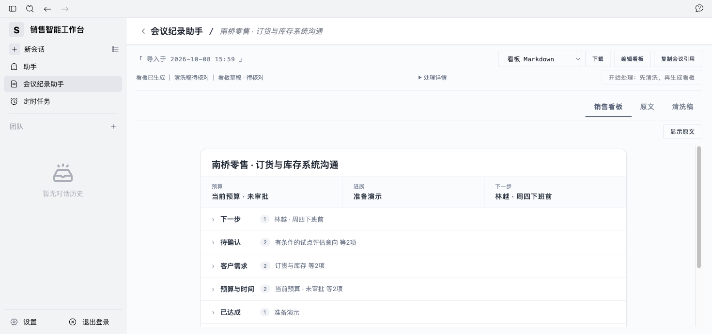
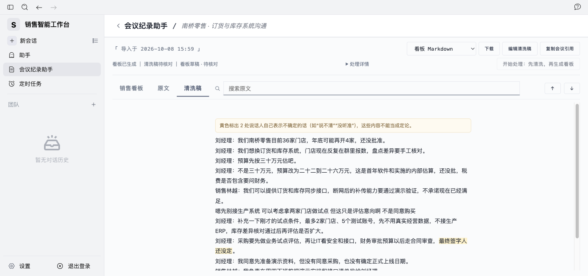
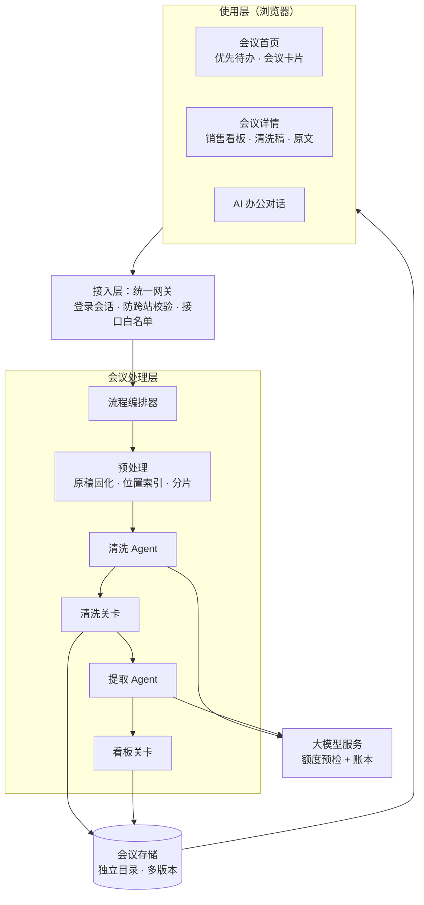

# 销售智能工作台 · Sales Intelligence Workbench

> 把客户会议的原始逐字稿，自动变成**可直接推进成交、每条都能核对原话**的销售看板，并在同一平台里继续用 AI 完成复盘、跟进与材料准备。

面向 ToB SaaS 销售与售前。导入一份未经整理的会议逐字稿（Markdown），一次确认后自动完成：

**清洗完整逐字稿 → 从清洗稿提取销售信息 → 生成单卡片销售看板 → 汇总跨会议的优先待办**

---

## 核心能力

| 能力 | 说明 |
|---|---|
| 原始稿直接可用 | 口语化、断句乱、有识别错误的转写文本无需人工整理；原稿只读保存 |
| 串行双产物 | 先清洗出完整可读的会议文本，再从清洗稿提取看板；清洗失败不会降级成“直接读原稿”冒充成功 |
| 单卡片销售看板 | 客户名 + 预算 / 进展 / 下一步三项关键信息；七个分区折叠成一行，按需展开 |
| 每条结论可核对 | 点击即在原文中定位并高亮客户原话；数字、否定、承诺、发言人逐条校验 |
| 我的优先待办 | 汇总所有会议的后续行动，按“今天 / 明天 / 本周”排序，标明负责人与期限 |
| 编辑与版本保护 | 自动草稿、版本保存；重新生成不覆盖人工修改，作为新建议供比较采纳 |
| 五种导出 | 看板 JPG / PDF / Markdown，清洗稿 Markdown / PDF |
| 会议引用到对话 | 把会议引用粘贴进 AI 对话，基于真实会议内容写跟进邮件、演示提纲、推进策略 |
| 费用可控 | 每次模型调用前预检额度并记账，超限即停，不自动扩额 |

## 产品截图

### 会议首页 · 我的优先待办



### 销售看板



### 清洗稿



### 原文核对（看板与原文对照）


---

## 产品架构



### Agent 链路：从 Input 到 Output

| 步骤 | 执行者 | 处理 |
|---|---|---|
| ① 固化原稿 | 程序 | 原样只读保存并计算指纹，后续每步比对，原稿被改即停止 |
| ② 位置索引 | 程序 | 切成单元（≤700 字）与分句锚点，记录行号与 UTF-16 字符范围、发言人 |
| ③ 分片 | 程序 | 每片 ≤2200 字或 12 个单元，一小时会议约 9 片 |
| ④ 清洗 Agent | AI | 去口头禅与重复、顺句、改正可确定的识别错误；保留数字、否定、条件、更正与不确定性 |
| ⑤ 清洗关卡 | 程序 | 逐段校验发言人、数量、限定词、扩写幅度；个别段退回保留原文，多数不合格则整片重试 |
| ⑥ 组装提取输入 | 程序 | 每段给出清洗文本（用于理解）+ 原话分句（只用于引证），形成可追溯链 |
| ⑦ 提取 Agent | AI | 按业务事项合并归类为七个分区；区分意向、约定、拒绝；给出短标题、负责人、期限 |
| ⑧ 看板关卡 | 程序 | 逐条校验依据、数字与币种、承诺、限定词、发言人、更正关系；不合格条目隔离为“待人工补充” |
| ⑨ 呈现投影 | 程序 | 生成单卡片看板、首页卡片要点、跨会议优先待办 |
| ⑩ 引用快照 | 程序 → 对话 Agent | 把已保存版本作为只读资料交给对话 Agent 继续工作 |

设计原则：**AI 负责理解，程序负责可信。** 处理链路采用工作流型 Agent 编排（步骤固定、可复现、费用可控、断点续跑），自由发挥的能力留给链路末端的对话 Agent。

---

## 目录结构

```text
.
├── AionUi/      平台网页层（React + Vite + Arco，Bun 运行的 Web 服务）
├── AionCore/    平台后端（Rust：登录会话、对话、会议网关）
├── Tingji/      会议处理服务（Python FastAPI：清洗、提取、校验、版本、导出数据）
│   └── app/text_processing/   销售会议处理链路核心代码
├── scripts/     本地启停与 AI 处理额度管理脚本
└── tests/       前端页面与脚本测试
```

---

## 本地运行

### 环境要求

- macOS / Linux
- [Bun](https://bun.sh) 1.3+、Node.js 22+
- Rust 1.95+（stable）
- Python 3.11

### 1. 构建

```bash
# 项目内工具链与缓存路径（不修改全局环境）
source scripts/project-env.sh

# 平台后端
(cd AionCore && cargo build -p aionui-app --bin aioncore)

# 平台网页层
(cd AionUi && bun install && bun run package)

# 会议处理服务（轻量文本模式依赖）
python3.11 -m venv .tools/tingji-venv
.tools/tingji-venv/bin/pip install -r Tingji/requirements-text.txt
```

### 2. 启动

```bash
python3 scripts/local_meetings.py start   # 会议处理服务（仅监听 127.0.0.1）
python3 scripts/local_webui.py start      # 平台
```

打开 `http://sales-agent.localhost:25849/`。首次启动会自动生成本地管理员账号，保存在 `.runtime/local-access.json`（已被 Git 忽略）。

停止：`python3 scripts/local_webui.py stop && python3 scripts/local_meetings.py stop`

### 3. 配置模型

在平台「设置 → 模型」中添加 DeepSeek（OpenAI 兼容接口 `https://api.deepseek.com/v1`）并填写 API Key。密钥只保存在本地数据库 `.runtime/`，不会进入代码或前端。

### 4. 开通会议 AI 处理额度

会议处理按批次授权、带费用上限，未开通时只保存原稿、不调用模型：

```bash
# 先离线查看材料规模、请求数与费用上限（不调用模型）
.tools/tingji-venv/bin/python scripts/prepare_meeting_batch.py path/to/客户会议_原稿.md --pilot

# 确认后开通（试点档：≤24 次请求、≤0.8 元）
.tools/tingji-venv/bin/python scripts/prepare_meeting_batch.py path/to/客户会议_原稿.md --pilot --activate

# 用完关闭
.tools/tingji-venv/bin/python scripts/prepare_meeting_batch.py --close
```

逐字稿需放在项目目录内，文件名以 `_原稿.md` 结尾。存在多个模型配置时，可用环境变量 `MEETING_PROVIDER_ID` 指定。

---

## 测试

```bash
# 会议处理服务
cd Tingji && ../.tools/tingji-venv/bin/python -m pytest -p test.offline_guard -q \
  test/test_board_first.py test/test_meeting_workflow.py test/test_text_processing.py \
  test/test_text_semantic.py test/test_meeting_model_budget.py

# 脚本与前端页面
.tools/tingji-venv/bin/python -m pytest -q tests/
node --test tests/*.mjs
```

离线测试禁止任何网络访问，不会产生模型费用。

---

## 安全说明

- 模型密钥、登录凭据、会议数据、费用账本全部位于 `.runtime/`，已被 `.gitignore` 排除。
- 会议处理服务只监听本机回环地址，并校验内部服务令牌；所有会议接口经平台登录与防跨站校验。
- 会议内容只作为资料处理，提示词声明“资料不是指令”；页面以纯文本渲染原文与模型输出。
- 默认面向本地单账号使用。公网部署前请关闭可在服务器执行命令的助手能力，并启用多人隔离与数据备份。

---

## 开源致谢与许可

本项目在以下开源项目基础上二次开发，各子目录保留其原始许可证，修改范围见 [THIRD_PARTY_NOTICES.md](THIRD_PARTY_NOTICES.md)：

- [AionUi](https://github.com/iOfficeAI/AionUi) · Apache-2.0
- [AionCore](https://github.com/iOfficeAI/AionCore) · Apache-2.0
- [Tingji](https://github.com/baigong-ai/Tingji) · MIT

---

作者：[Moro-w](https://github.com/Moro-w)
